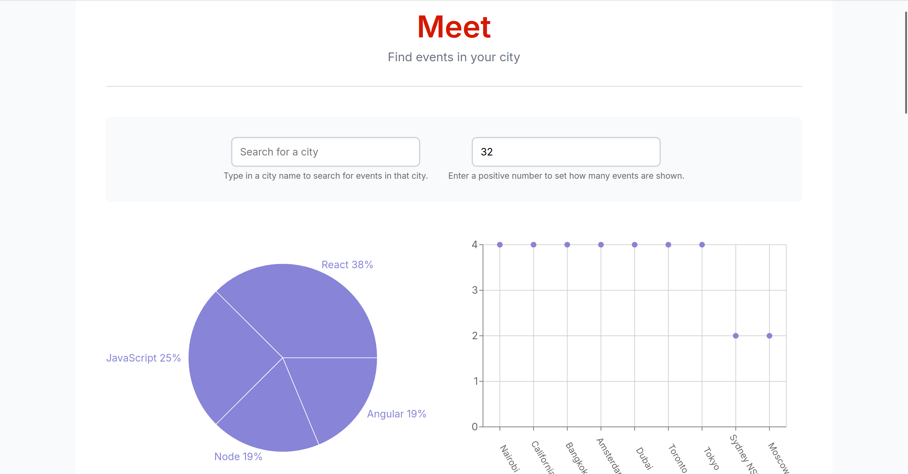
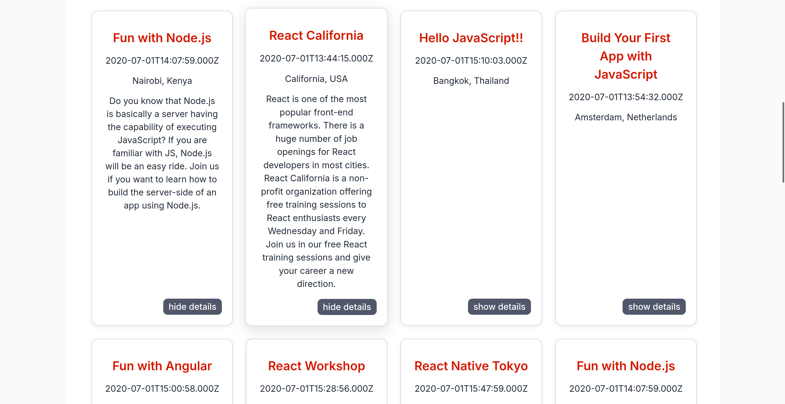

# Meet App

Minimal, serverless Progressive Web App (PWA) to browse and visualize upcoming events by city. Built with React, fully tested, and developed using TDD.

The app integrates with the Google Calendar API and uses AWS Lambda serverless functions to fetch upcoming events across different cities.



## Overview

Meet App allows users to:

- Search for a city and view upcoming events
- Expand/collapse event details
- Control how many events to display
- Use the app offline (service workers)
- Install the app on desktop or mobile (PWA)
- View interactive charts showing event distribution and genres

The application is fully tested (Jest + React Testing Library) and developed following strict TDD cycles.



## Technologies Used

- React (Vite)
- Jest & React Testing Library (TDD)
- Google Calendar API
- OAuth2 authentication
- AWS Lambda (Serverless Functions)
- Recharts (data visualization)
- Service Workers / PWA
- Vercel deployment

## Installation & Setup

1. Clone the repository
2. Install dependencies:
	```sh
	npm install
	```
3. Start the development server:
	```sh
	npm run dev
	```

## License

MIT
